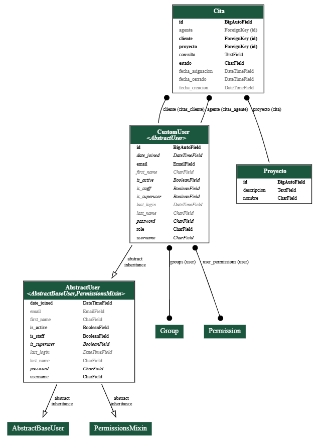
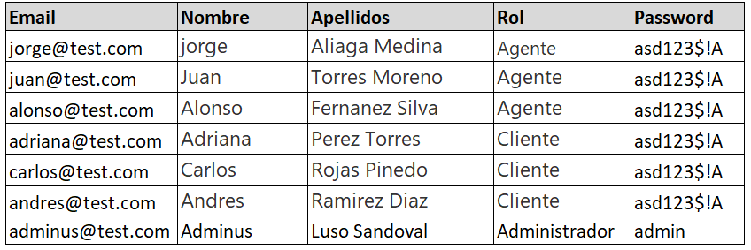

# Documentación del Proyecto

El proyecto ha sido desarrollado utilizando el framework **Django** de Python y **MySQL** como sistema de gestión de bases de datos. A continuación, se detallan los pasos necesarios para desplegar correctamente el proyecto en un entorno local.

---

## **Requisitos Previos**

1. **Python**: Asegúrate de tener instalada la versión adecuada de Python (3.8 o superior).
2. **MySQL**: Un servidor MySQL configurado.
3. **Pip**: El gestor de paquetes de Python.
4. **Entorno virtual**: Para aislar las dependencias del proyecto.

---

## **Instrucciones para Desplegar el Proyecto**

### **1. Crear el entorno virtual**
Crea un entorno virtual para evitar conflictos con las librerías instaladas en tu sistema global:

```bash
python.exe -m venv .venv
```

### **2. Activar el entorno virtual**
Activa el entorno virtual dentro del directorio donde lo creaste:

```bash
.\.venv\Scripts\activate
```


### **3. Instalar las dependencias**
Con el entorno virtual activado, instala las dependencias necesarias para el proyecto usando el archivo `requirements.txt`:

```bash
pip install -r requirements.txt
```

### **4. Configurar las credenciales de la base de datos**
Modifica el archivo `.env` con las credenciales correspondientes de tu servidor MySQL. El archivo debe incluir las siguientes variables:

```
DB_NAME=nombre_de_la_base_de_datos
DB_USER=usuario
DB_PASSWORD=contraseña
DB_HOST=localhost
DB_PORT=3306
```

---

### **5. Aplicar las migraciones**
Ejecuta las migraciones de la base de datos para crear las tablas necesarias:

```bash
python manage.py makemigrations citas
python manage.py migrate citas
python manage.py migrate
```

> El esquema de la base de datos y sus relaciones son las siguientes:



---

## **Despliegue en la Nube**
Si se presenta dificultades para ejecutar el proyecto de manera local, puede interactuar con la versión ya desplegada en la nube a través del siguiente enlace:

[Enlace de la prueba](https://surcodevv.eu.pythonanywhere.com)

Usuarios de Prueba:


